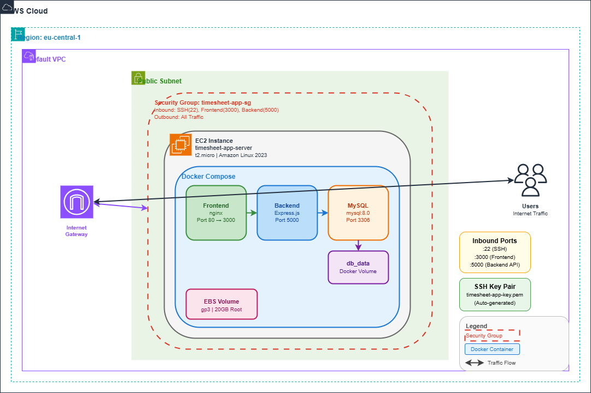

# Deploy a Multi-Container App on EC2 (Node.js + MySQL)

A simple **Timesheet App** with a frontend UI and RESTful API backend.

## Architecture



> 📊 **[Open Interactive Diagram](docs/architecture.drawio)** - Open with [draw.io](https://app.diagrams.net) for full editing

<details>
<summary>View ASCII Diagram</summary>

```
┌──────────────────────────────────────────────────────────────────────────────────┐
│                                  AWS Cloud                                        │
│  ┌────────────────────────────────────────────────────────────────────────────┐  │
│  │                         Region: eu-central-1                                │  │
│  │  ┌──────────────────────────────────────────────────────────────────────┐  │  │
│  │  │                           Default VPC                                 │  │  │
│  │  │  ┌────────────────────────────────────────────────────────────────┐  │  │  │
│  │  │  │                        Public Subnet                            │  │  │  │
│  │  │  │  ┌──────────────────────────────────────────────────────────┐  │  │  │  │
│  │  │  │  │  Security Group: timesheet-app-sg                         │  │  │  │  │
│  │  │  │  │  ┌────────────────────────────────────────────────────┐  │  │  │  │  │
│  │  │  │  │  │  EC2 Instance (t2.micro - Amazon Linux 2023)       │  │  │  │  │  │
│  │  │  │  │  │  Name: timesheet-app-server                        │  │  │  │  │  │
│  │  │  │  │  │  ┌──────────────────────────────────────────────┐  │  │  │  │  │  │
│  │  │  │  │  │  │              Docker Compose                   │  │  │  │  │  │  │
│  │  │  │  │  │  │  ┌──────────┐ ┌──────────┐ ┌──────────────┐  │  │  │  │  │  │  │
│  │  │  │  │  │  │  │ Frontend │→│ Backend  │→│    MySQL     │  │  │  │  │  │  │  │
│  │  │  │  │  │  │  │  nginx   │ │ Express  │ │    8.0       │  │  │  │  │  │  │  │
│  │  │  │  │  │  │  │ :3000    │ │ :5000    │ │   :3306      │  │  │  │  │  │  │  │
│  │  │  │  │  │  │  └──────────┘ └──────────┘ └──────┬───────┘  │  │  │  │  │  │  │
│  │  │  │  │  │  │                                   │          │  │  │  │  │  │  │
│  │  │  │  │  │  │                            ┌──────▼───────┐  │  │  │  │  │  │  │
│  │  │  │  │  │  │                            │   db_data    │  │  │  │  │  │  │  │
│  │  │  │  │  │  │                            │(Docker Vol)  │  │  │  │  │  │  │  │
│  │  │  │  │  │  │                            └──────────────┘  │  │  │  │  │  │  │
│  │  │  │  │  │  └──────────────────────────────────────────────┘  │  │  │  │  │  │
│  │  │  │  │  │  ┌──────────────────┐                              │  │  │  │  │  │
│  │  │  │  │  │  │ EBS: gp3 (20GB)  │                              │  │  │  │  │  │
│  │  │  │  │  │  └──────────────────┘                              │  │  │  │  │  │
│  │  │  │  │  └────────────────────────────────────────────────────┘  │  │  │  │  │
│  │  │  │  │                           ▲                               │  │  │  │  │
│  │  │  │  │                           │ Inbound Rules:                │  │  │  │  │
│  │  │  │  │                           │  • SSH (22) - CIDR restricted │  │  │  │  │
│  │  │  │  │                           │  • HTTP (3000) - 0.0.0.0/0    │  │  │  │  │
│  │  │  │  │                           │  • HTTP (5000) - 0.0.0.0/0    │  │  │  │  │
│  │  │  │  └───────────────────────────┼───────────────────────────────┘  │  │  │  │
│  │  │  └──────────────────────────────┼──────────────────────────────────┘  │  │  │
│  │  │   ┌──────────────┐              │                                     │  │  │
│  │  │   │   Internet   │◄─────────────┘                                     │  │  │
│  │  │   │   Gateway    │                                                    │  │  │
│  │  │   └──────────────┘                                                    │  │  │
│  │  └───────────────────────────────────────────────────────────────────────┘  │  │
│  └─────────────────────────────────────────────────────────────────────────────┘  │
│                                       ▲                                           │
└───────────────────────────────────────┼───────────────────────────────────────────┘
                                        │
                              ┌─────────▼─────────┐
                              │      Users        │
                              │ (Internet Traffic)│
                              │                   │
                              │ :3000 → Frontend  │
                              │ :5000 → API       │
                              │ :22   → SSH       │
                              └───────────────────┘
```

</details>

### AWS Resources Summary

| Resource | Name/ID | Description |
|----------|---------|-------------|
| **VPC** | Default VPC | Auto-created default VPC |
| **Subnet** | Public Subnet | Public subnet with Internet access |
| **Internet Gateway** | Default IGW | Provides Internet connectivity |
| **Security Group** | `timesheet-app-sg` | Controls inbound/outbound traffic |
| **EC2 Instance** | `timesheet-app-server` | t2.micro, Amazon Linux 2023 |
| **EBS Volume** | gp3 | 20GB root volume |
| **Key Pair** | `timesheet-app-key` | Auto-generated SSH key |

### Security Group Rules

| Direction | Port | Protocol | Source/Destination | Purpose |
|-----------|------|----------|-------------------|---------|
| Inbound | 22 | TCP | `allowed_ssh_cidr` | SSH access |
| Inbound | 3000 | TCP | 0.0.0.0/0 | Frontend (nginx) |
| Inbound | 5000 | TCP | 0.0.0.0/0 | Backend API |
| Outbound | All | All | 0.0.0.0/0 | All outbound traffic |

### Container Architecture

```
┌─────────────────┐     ┌─────────────────┐     ┌─────────────────┐
│    Frontend     │────▶│     Backend     │────▶│     MySQL       │
│    (nginx)      │     │   (Express)     │     │    Database     │
│   Port 3000     │     │   Port 5000     │     │   Port 3306     │
└─────────────────┘     └─────────────────┘     └─────────────────┘
```

## Project Structure

```
├── docker-compose.yml      # Multi-container orchestration
├── .env.example            # Environment variables template
├── frontend/               # Frontend service (nginx)
│   ├── Dockerfile
│   ├── nginx.conf
│   └── public/
│       ├── index.html
│       ├── styles.css
│       └── app.js
├── web/                    # Backend API service (Node.js)
│   ├── Dockerfile
│   ├── package.json
│   └── app.js
├── db/                     # Database initialization
│   └── init.sql
├── scripts/                # Deployment & operations
│   └── deploy.sh
└── terraform/              # Infrastructure as Code
    ├── main.tf
    ├── variables.tf
    ├── outputs.tf
    └── modules/
        ├── compute/
        ├── security/
        └── keypair/
```

## API Endpoints

| Method | Endpoint       | Description              |
|--------|----------------|--------------------------|
| GET    | `/`            | Health check             |
| GET    | `/entries`     | List all timesheet entries |
| POST   | `/entries`     | Add a new entry          |
| GET    | `/entries/:id` | Get a single entry       |
| PUT    | `/entries/:id` | Update an entry          |
| DELETE | `/entries/:id` | Delete an entry          |

### Sample POST body
```json
{
  "employee_name": "Alice",
  "date": "2026-02-06",
  "hours_worked": 8,
  "description": "Backend development"
}
```

## Quick Local Run

```bash
# Configure environment
cp .env.example .env

# Deploy with logging (recommended)
bash scripts/deploy.sh up

# Or manually
docker compose up --build -d

# Access
# Frontend: http://localhost:3000
# Backend:  http://localhost:5000/entries

# Cleanup
bash scripts/deploy.sh clean
```

## Deploy Script

The deploy script logs all output including Docker daemon errors:

```bash
bash scripts/deploy.sh up      # Build and start (logs to logs/*.log)
bash scripts/deploy.sh down    # Stop containers
bash scripts/deploy.sh logs    # View live container logs
bash scripts/deploy.sh status  # Show status and recent logs
bash scripts/deploy.sh clean   # Stop and remove volumes
```

Logs are saved to `logs/deploy_YYYYMMDD_HHMMSS.log`

## EC2 Deployment with Terraform

### Prerequisites
- [Terraform](https://developer.hashicorp.com/terraform/downloads) >= 1.0
- AWS CLI configured (`aws configure`)

### Deploy Infrastructure

```bash
cd terraform
cp terraform.tfvars.example terraform.tfvars
# Edit terraform.tfvars (key pair is auto-generated by default)

terraform init
terraform plan
terraform apply
```

Terraform outputs:
- `frontend_url` – Frontend UI URL
- `api_url` – Backend API URL  
- `ssh_command` – Ready-to-use SSH command
- `private_key_path` – Path to generated .pem file

### Auto-Start Mode (Default)

With `auto_start = true` (default), the app starts automatically after Terraform apply:

```bash
# Configure credentials (choose one method)

# Method 1: In terraform.tfvars (simple but less secure)
db_root_password = "your-secure-root-password"
db_password      = "your-secure-app-password"

# Method 2: Environment variables (recommended)
export TF_VAR_db_root_password="your-secure-root-password"
export TF_VAR_db_password="your-secure-app-password"

# Deploy (app starts automatically!)
terraform apply

# Access immediately
# Frontend: http://<public_ip>:3000
# Backend:  http://<public_ip>:5000
```

### Manual Start Mode

With `auto_start = false`, you SSH in and configure manually:

```bash
# In terraform.tfvars
auto_start = false

terraform apply

# SSH into the instance (command from terraform output)
ssh -i ./timesheet-app-key.pem ec2-user@<public_ip>

# Wait for setup to complete
cat ~/setup-complete.txt

# Configure and start
cd ~/app
nano .env  # Set secure passwords
bash scripts/deploy.sh up
```

### Cleanup

```bash
# On EC2
bash scripts/deploy.sh clean

# Destroy infrastructure
cd terraform
terraform destroy
```

---

## Manual EC2 (Amazon Linux 2) Deployment

1. Provision an EC2 instance (Amazon Linux 2) and open ports 22, 3000, and 5000 in the security group.
2. SSH into the instance and install Docker & Compose:

```bash
sudo amazon-linux-extras install docker -y
sudo service docker start
sudo usermod -a -G docker ec2-user
sudo curl -SL "https://github.com/docker/compose/releases/latest/download/docker-compose-$(uname -s)-$(uname -m)" -o /usr/local/bin/docker-compose
sudo chmod +x /usr/local/bin/docker-compose
```

3. Clone this repo, configure `.env`, then run:

```bash
cd Deploy_a_Multi-Container_App_on_EC2
cp .env.example .env
nano .env  # Edit with secure passwords
bash scripts/deploy.sh up
```

4. Access:
   - Frontend: `http://<public_ip>:3000`
   - Backend API: `http://<public_ip>:5000`

5. Cleanup:

```bash
bash scripts/deploy.sh clean
```

---

## Troubleshooting

### Port Already in Use
If you see `ports are not available` error:
```bash
# Check what's using the port
netstat -ano | findstr :3000   # Windows
lsof -i :3000                   # Linux/Mac

# Change port in .env
FRONTEND_PORT=8080
```

### View Logs
```bash
# Deploy logs (including Docker daemon errors)
cat logs/deploy_*.log

# Container logs
bash scripts/deploy.sh logs
docker compose logs -f web      # Backend only
docker compose logs -f frontend # Frontend only
```

---

## Evidence
Take screenshots of:
- Frontend UI at `http://localhost:3000`
- `curl` output showing API responses
- `docker ps` after deployment
- Screenshot after cleanup showing no running containers

